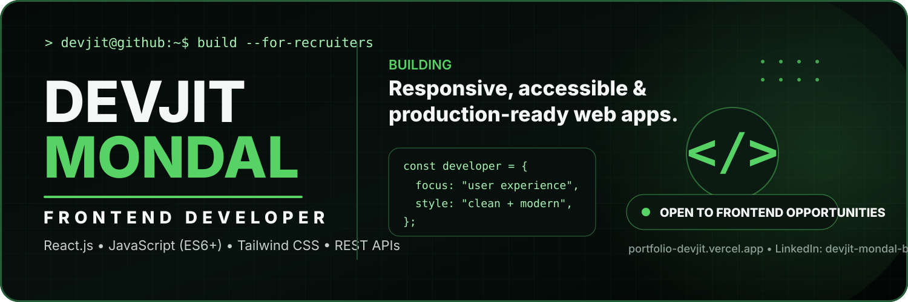
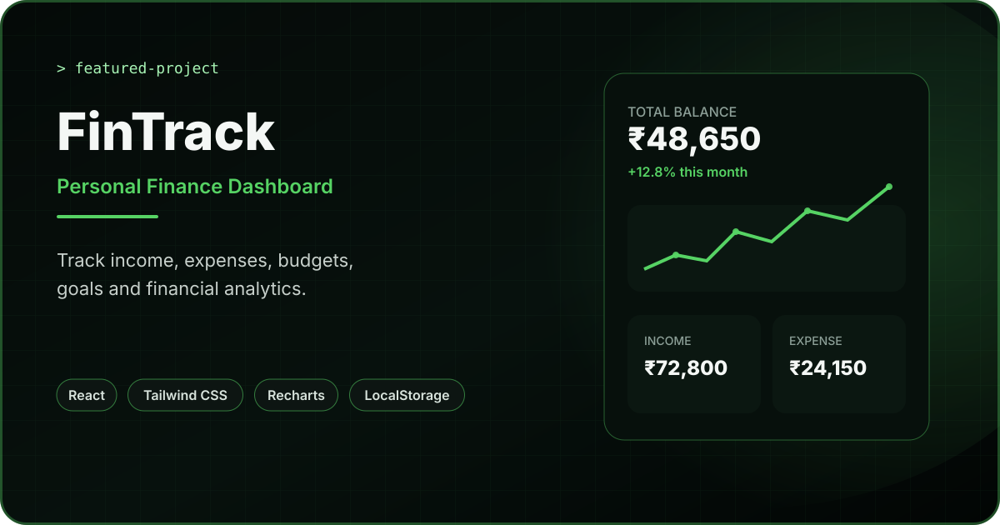
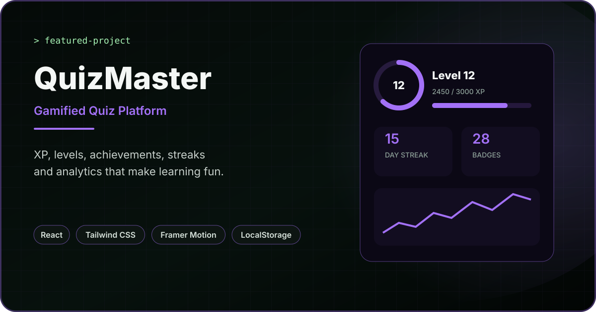
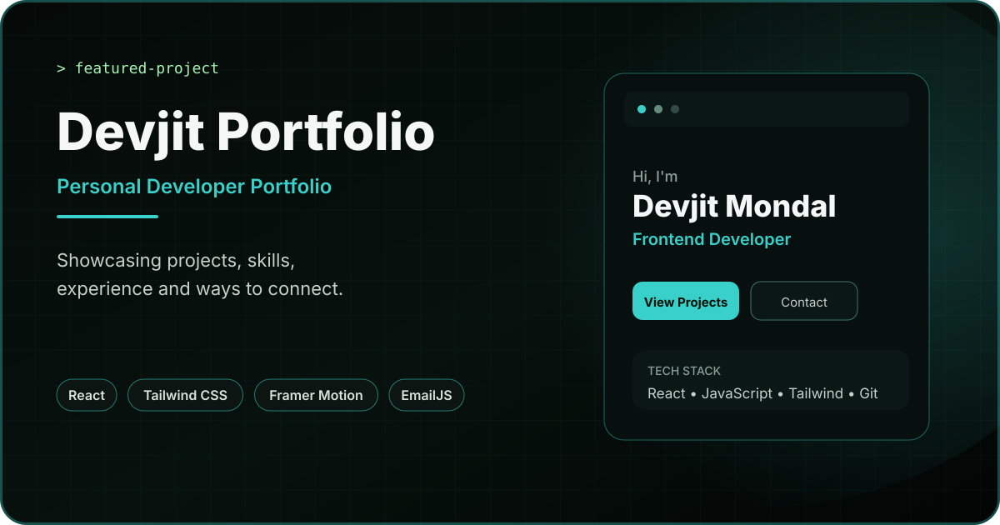
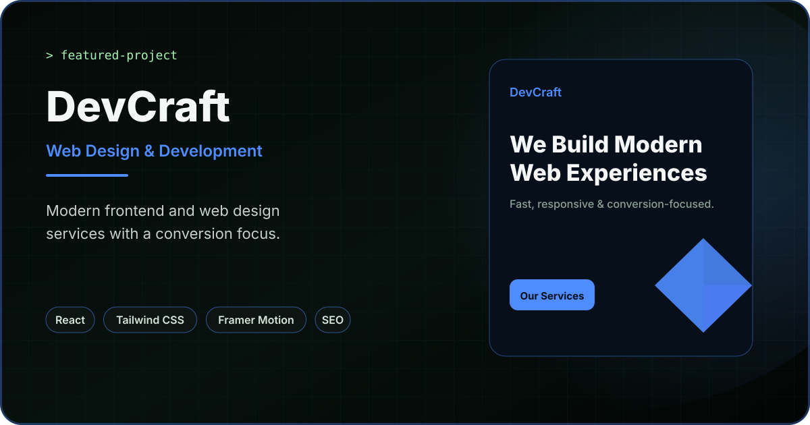
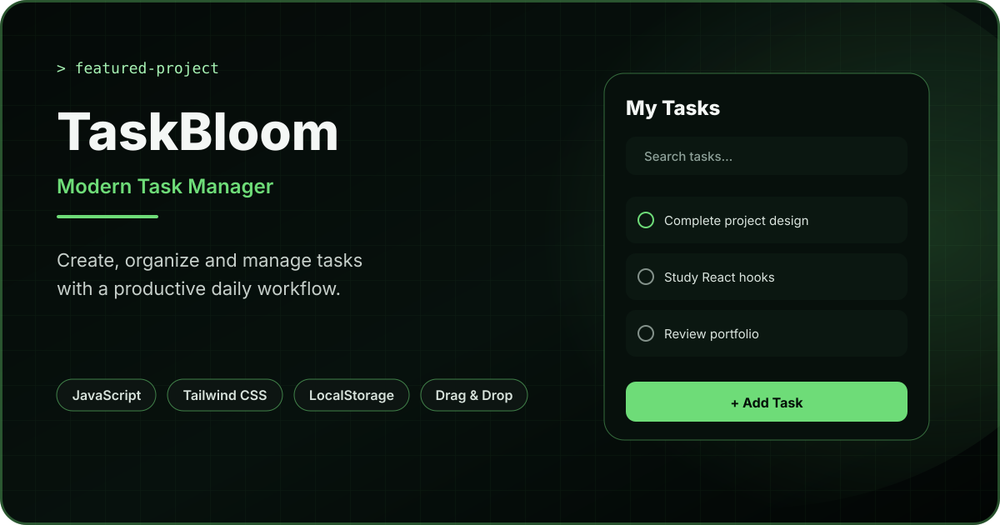

<div align="center">



<br/>

[](https://portfolio-devjit.vercel.app/)
[](https://www.linkedin.com/in/devjit-mondal-b68947233/)
[](https://github.com/devjit1520)

</div>

---

```text
> devjit --profile

ROLE        Frontend Developer
FOCUS       React.js / JavaScript / Modern UI
LOCATION    India
STATUS      Open to Frontend & React opportunities
```

## About Me

I'm a **Frontend Developer** focused on building modern, responsive and user-friendly web applications with **React.js, JavaScript and Tailwind CSS**.

I enjoy turning ideas into polished interfaces, working with APIs, creating reusable component systems and improving application structure, performance and user experience.

- Building real-world frontend projects with React and modern JavaScript
- Working with responsive layouts, component architecture and application state
- Integrating REST APIs and browser storage
- Focused on clean UI, maintainable code and practical user experiences
- Continuously improving advanced React and frontend architecture skills

---

## Featured Work

<table>
<tr>
<td width="50%" valign="top">

<a href="https://fintrack-devjit.vercel.app/"></a>

**Personal Finance Management Dashboard**

Track transactions, budgets, financial goals and analytics through a responsive React dashboard.

[**Live Demo ↗**](https://fintrack-devjit.vercel.app/) · [**Source Code →**](https://github.com/devjit1520/fintrack)

</td>
<td width="50%" valign="top">

<a href="https://quiz-application-lyart-two.vercel.app/"></a>

**Gamified Frontend Quiz Platform**

Interactive quizzes with XP, levels, achievements, streaks, analytics and persistent progress tracking.

[**Live Demo ↗**](https://quiz-application-lyart-two.vercel.app/) · [**Source Code →**](https://github.com/devjit1520/quiz_application)

</td>
</tr>
<tr>
<td width="50%" valign="top">

<a href="https://weathernow-weather-dashboard.vercel.app/"></a>

**Real-Time Weather Dashboard**

Weather search, autocomplete, geolocation, forecasts, saved cities and temperature preferences using real-time APIs.

[**Live Demo ↗**](https://weathernow-weather-dashboard.vercel.app/) · [**Source Code →**](https://github.com/devjit1520/weathernow-weather-dashboard)

</td>
<td width="50%" valign="top">

<a href="https://portfolio-devjit.vercel.app/"></a>

**Personal Frontend Developer Portfolio**

A modern portfolio showcasing projects, technical skills and frontend development work through a polished responsive interface.

[**Live Demo ↗**](https://portfolio-devjit.vercel.app/) · [**Source Code →**](https://github.com/devjit1520/Devjit-portfolio)

</td>
</tr>
<tr>
<td width="50%" valign="top">

<a href="https://devcraft-peach.vercel.app/"></a>

**Web Design & Frontend Services Website**

A professional services website focused on modern frontend development, responsive design, SEO and conversion-focused UI.

[**Live Demo ↗**](https://devcraft-peach.vercel.app/) · [**Source Code →**](https://github.com/devjit1520/devcraft)

</td>
<td width="50%" valign="top">



**Modern Task Management Application**

Task CRUD, search, filters, priorities, deadlines, drag-and-drop sorting, dark mode and LocalStorage persistence.

[**Source Code →**](https://github.com/devjit1520/Todo_Manager)

</td>
</tr>
</table>

---

## Tech Stack

### Frontend

<p>
  
  
  
  
  
</p>

### Libraries & Development

<p>
  
  
  
  
  
  
</p>

### What I Work With

`Responsive Web Design` · `Component-Based Architecture` · `REST APIs` · `LocalStorage` · `State Management` · `Data Visualization` · `Form Handling` · `Frontend Performance`

---

## GitHub Activity

<div align="center">


<br/>


</div>

---

## Currently

```text
BUILDING     Production-quality frontend applications
IMPROVING    Advanced React, JavaScript and frontend architecture
LEARNING     Better performance, accessibility and scalable UI patterns
LOOKING FOR  Frontend Developer / React Developer opportunities
```

---

## Let's Connect

I'm open to **Frontend Developer**, **React Developer**, internship and collaboration opportunities where I can contribute to real products and continue growing as a developer.

<p>
  <a href="https://portfolio-devjit.vercel.app/"></a>
  <a href="https://www.linkedin.com/in/devjit-mondal-b68947233/"></a>
</p>

---

<div align="center">

### `build → learn → improve → repeat`

<sub>Thanks for visiting my GitHub profile.</sub>

</div>
